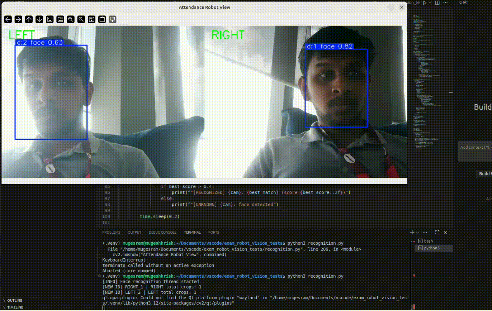

# Vision Module – Dual-Camera Object Tracking

This repository contains the **current vision implementation** for an exam proctoring robot.  
At this stage, the system is limited to **real-time object tracking on two camera feeds**.

The goal of this phase is to validate **multi-camera processing, threading stability, and model isolation** before adding higher-level logic such as face recognition or attendance marking.

---

## Demo for Tracking

---

## Demo for Recognition in Dual Camera Feed

Method to use Demo
 - Add faces with name
 - Run data_update.py to save encodings (currently in json later in db)
 - Run recognition.py to test recognition feature (only works with dual cam , port should be updated in code)
---

## Current Features

### Implemented
- Two simultaneous camera feeds
- Parallel processing using Python threads
  - One thread per camera
- Object detection and tracking
- Two independent model instances
  - One model loaded per thread
  - Prevents model-level race conditions
- Thread-safe execution
  - Shared resources protected using locks
- Real-time visualization
  - Running the script shows tracking output for both cameras
- Real time Face Recognition

---

### Not Implemented Yet
- Attendance marking with Database
- ROS2 integration
- Database or persistent storage
- Cross-camera identity association
- Proctoring or violation detection logic

---

## High-Level Architecture

- Each camera feed is processed independently
- Models are **not shared** across threads
- Synchronization primitives (locks) are used where shared access is required

---

## Design Decisions

### Why Object Tracking Only?
- Continuous recognition or re-identification is computationally expensive
- Tracking allows stable identity persistence across frames
- This phase focuses on validating tracking performance and stability

### Why Separate Models per Thread?
- Many inference frameworks are not thread-safe
- Sharing a model instance across threads can cause race conditions
- Loading one model per thread ensures deterministic behavior

### Why Threads?
- Allows real-time parallel processing of multiple camera feeds
- Scales naturally to additional cameras in future iterations
